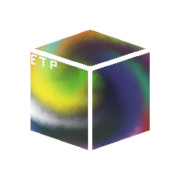

# Lib ETP
ETP is an incredibly simple image format designed for icons and pixel art. ETP stands for ***Easy*** Transparent Picture
## Design
##### 
The ETP header is **always** six chars long.
- The first three chars are "etp"
- The next char is the version (for example `0x10` is `1.0`)
- The final two chars are the size and width
##### 
The maximum size of an ETP is ~260kb
- this is because an ETP **cannot** be bigger than 255x255 (this may change in the future)
- ETP is **not** compressed so the quality will not be changed
#####
ETP is simple
- After a short header, all the data is raw RGBA
- Lib ETP is 122 lines long and EAT is only 26 lines long (and most of these lines are doxygen, code style, or the license info)
## Applications
ETP was designed with the following uses in mind:
- (very) low res images
- game assets
- pixel art
- icons
- games for retro/older consoles (ex. 7th/8th gen handhelds)
#####
.PNG will be more optimal in likely every situation, but ETP will be much easier to implement.
## Simplified Summary
Long story short, ETP is essentially a raw image with a small header.